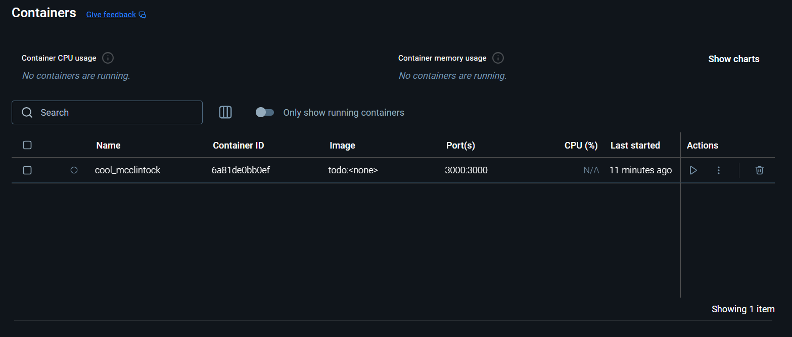
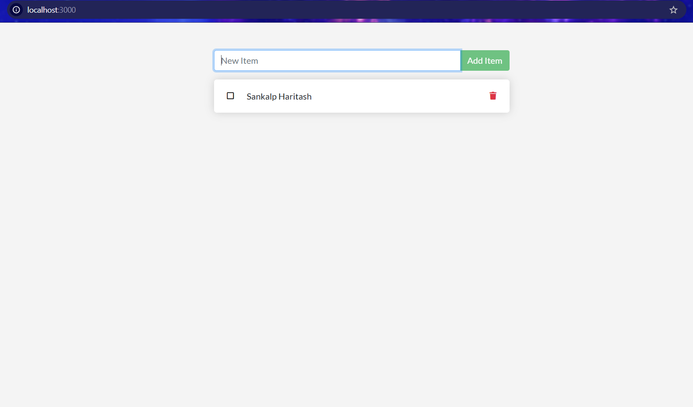

# Node.js To-Do App Docker Setup

### This guide walks through setting up Docker for a simple Node.js to-do app, enabling easy deployment and environment consistency.

1. Prerequisites
Docker: Ensure Docker is installed. Download Docker here if needed.

2. Project Structure
Your Node.js to-do app should include:

- Dockerfile: Contains instructions to build a Docker image for the Node.js app.
- (Optional) docker-compose.yml: To set up additional services, such as databases.
- Dockerfile Setup
Below is a sample Dockerfile for the Node.js to-do app. This should be in the root of your project.
 
```
# Use Node.js base image
FROM node:18

# Create app directory
WORKDIR /usr/src/app

# Install app dependencies
COPY package*.json ./
RUN npm install

# Copy app source code
COPY . .

# Expose port the app runs on
EXPOSE 3000

# Command to run the app
CMD ["node", "index.js"]

```

### check docker images using

```
docker images
```

Build the Docker Image: Build an image for the app using the Dockerfile:
```
docker build -t todo-app .
```

Run the Docker Container: Start a container from the built image:

```
docker run -it -d -p 3000:3000 todo-app
```

Note: Replace 3000 with the port your Node.js app uses.

- Using Docker Compose (Optional): If you have a docker-compose.yml file, run the app with:

```
docker-compose up
```

## Common Commands
1. List all containers:
```
docker ps -a
```

2. Stop the container:
```
docker stop <container-id>
```

3. Remove the container:
```
docker rm <container-id>
```

4. Logs: Check logs for errors:
```
docker logs <container-id>
```

